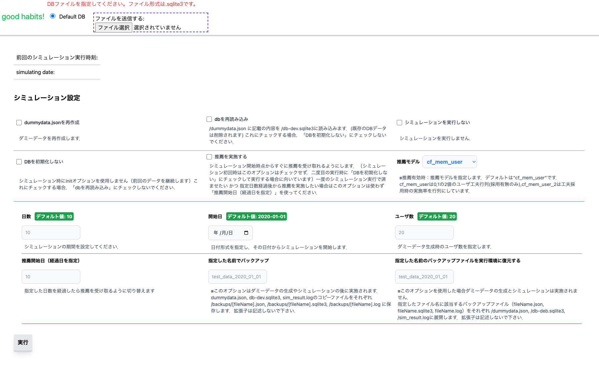

# good_habits
(最終編集日: 2024.2.19 Jotaro Nakamura)  
本プロジェクトは三好研究室の習慣化支援に関する研究の一つである  
**「習慣化支援アプリにおける試行錯誤を支援するための推薦機能及びシミュレーション環境の開発」**
に関するプロジェクトです。  

本プロジェクトは以下の機能を持っています。

- シミュレーション機能 (`/app`)
- WebUI (`/app`)
- 推薦機能 (`/pyapp`)

上記機能はすべてDockerコンテナで正常に起動しますが、
ネイティブ環境での起動確認はしていません(途中で諦めた...)。  
そのため、なるべくDockerで起動するようにして下さい。  
(推薦機能はDocker環境のみで作成したので特に注意)

##  シミュレーション機能 & WebUI
ソースコードは`/app`以下です。利用した技術は以下です。

```
Language     : Node.js (v16.15)
WebFrameWork : Express
WebUI        : EJS + Tailwind CSS
DB           : SQLite3
ORM          : Sequelize
```

推薦機能を実装するためにはユーザが習慣化支援アプリを用いて活動したデータが必要です。そのため、シミュレーション機能を用いてダミーのユーザの利用履歴データを生成し、習慣化する様子をシミュレートします。  
利用履歴データはDBに保存していき、Webビューア機能でグラフ表示できるようにしています。
Dockerの場合下記コンテナ起動後 `localhost:3000` にアクセスすると表示されます。

本機能は主に以下のファイルで構成されています。
- `app/simulation/generate_dummydata.js` : ダミーデータを生成しJSONファイルに出力
- `app/simulation/import_dummydata.js` : ダミーデータJSONファイルをDBに書き込み
- `app/simulation/simulate.js` : ダミーデータを利用してシミュレーションを実行する
- `app/start.sh` : 上記jsの制御用スクリプト，シミュレーションを実施する場合は基本的にこれを実行

**docker composeでWebUIを起動する場合**
- x86_64  
```bash
$ pwd
~/good_habits

$ docker compose up
```
- arm64(研究室のM1 Macはこっち) 
```bash
$ pwd
~/good_habits

$ docker compose -f docker-compose_arm64.yml up
```

時刻は[Libfaketime](https://github.com/wolfcw/libfaketime)を使用して偽装しています。  

### WebUIの機能説明

- トップページ
  
  コンテナを起動させ、localhost:3000にアクセスすると下図のような画面が描画されます。シミュレーション設定をし、「実行」ボタンを押すとシミュレーションを実行させることができます。

  

- ユーザ一覧ページ
  
  シミュレーションを実行してページをリロードすると下図右上のようにユーザ一覧ページへのリンクが出現します。

  

  ユーザ一覧ページにて各ユーザの詳細なパラメータを見ることができます。  
  画像左部にあるnameがユーザ名であり、ユーザ詳細ページへのリンクになっています。  
  ※下図赤線部分の前回の振り返り日がnullになっている場合、そのユーザのリンクをクリックしないで下さい（エラーになります）


  

- ユーザ詳細ページ

  ユーザ詳細ページで更にユーザの更に詳細なパラメータや詳細を知ることができる。  
  上から順にグラフ、シミュレーションログファイル、推薦ログファイルで構成されている。   
  
  1. グラフ  
    タスク達成数、実施率、モチベーションなどの時系列的なデータをグラフで確認できる。Chart.jsを利用した。データの集計・加工はフロント側でやってるのもあればサーバ側でやってたりもする（気がする）
  2. シミュレーションログファイル  
    サーバ側のログファイルを読み込んでここに表字しているだけ。jsを使ったキーワード検索機能だけ実装した。フロントで指定したDBファイルと同名の.logファイルを探して読み込んでいる
  3. 推薦ログファイル  
    これは推薦サーバ側に置かれたログファイルから読み込んで表字している。DBのタイムスタンプと近い推薦ログを探して表示する。推薦機能をオフにした場合何も表示されない。

  
  
  

##  推薦機能
ソースコードは`/pyapp`以下です。利用した技術は以下です。

```
Language               : python3.9
APIFrameWork           : FaktAPI
Recommendation process : Numpy, Pandas
```

SQLite3ファイルと推薦を受け取りたいユーザ，ワークを指定するとおすすめの工夫を返すWebAPIとして機能します。
シミュレーション機能 & WebUIで説明した `docker compose up` 実行時に既に組み込まれています。  

コンテナ間通信で `app/simulation/simulate.js` とやり取りしますが、ローカルで試したい場合は `localhost:8888` にアクセスすると応答します。

例：
```bash
curl --location 'localhost:8888/recommend/users/34/works/1?model=cf_mem_user' \
--form 'input_file=@"/path/to/file"'
```


## シミュレーションの流れ
app/simulation/simulate.jsの中身をフローチャートにしたものです。多数箇所を省略しているので、これに全ての処理が記載されているわけではありません。


## 最後に
本プログラムの改良、修正を行う場合、bash,docker,js,ejs,tailwind css,sequelize, libfaketime, sqlなどの技術を知っておく必要があります。
本プログラムを改良する場合、一度clone,forkなどでローカルに取り込んで複製した後、
新しいリポジトリとして始める（git履歴をまっさらにする）ことをおすすめします。
2024年4月程度までなら不明点について私(github: jo-naka)に連絡してもらえれば受け答えできます。
